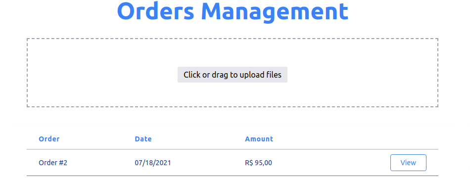

<h1 align="center">
  Dev 9Nama Test
</h1>

<p align="center">
  <a href="#-technologies">Technologies</a>&nbsp;&nbsp;&nbsp;|&nbsp;&nbsp;&nbsp;
  <a href="#-getting-started">Getting started</a>&nbsp;&nbsp;&nbsp;|&nbsp;&nbsp;&nbsp;
  <a href="#-project">Project</a>&nbsp;&nbsp;&nbsp;|&nbsp;&nbsp;&nbsp;
  <a href="#-layout">Layout</a>&nbsp;&nbsp;&nbsp;|&nbsp;&nbsp;&nbsp;
  <a href="#-next-steps">Next steps</a>
</p>

<h1 align="center">
  
</h1>

---

## 🧪 Technologies

This project was developed using the following technologies:

- [Ruby](https://www.ruby-lang.org/)
- [Rails](https://rubyonrails.org/)
- [Interactor](https://github.com/collectiveidea/interactor)
- [DropzoneJS](https://github.com/ncuesta/dropzonejs-rails)
- [Toastr](https://github.com/tylergannon/toastr-rails)
- [Tailwind](https://tailwindcss.com/)

## 🚀 Getting started

This project use **ruby 2.7.0** and **rails 5.2.6**. I recommend installing [RVM](https://rvm.io/) on your machine to change ruby and rails versions more easily and make better use of this project.

Clone the project and access the folder

```bash
$ git clone https://github.com/eltonsantos/dev-9nama-test.git && cd dev-9nama-test
```

Follow the steps below
```bash
# Install the dependencies
$ bundle install

# Create database
$ rails db:create

# Create migrations
$ rails db:migrate

# Start server
$ rails s

```

Or just for knowledge, to create the basic structure of the project, the following commands bellow were used

```bash
# Create project
$ rails new dev-9nama-test

# Create model Customer
$ rails g model Customer name:index

# Create model Supplier
$ rails g model Supplier name:index address:index

# Create model Product
$ rails g model Product description:index price:decimal{8-2}:index

# Create scaffold Orders
$ rails g scaffold Orders

# Create model Item
$ rails g model Item order:references product:references supplier:references customer:references quantity:integer

# Create database
$ rails db:create

# Create migrations
$ rails db:migrate

# Start server
$ rails s

```

## 💻 Project

This project was developed for testing in the company 9Nama, in the July 17, 2021. The project consists of receiving a csv or txt file, processing the file and adding it to the sqlite database. Also, be able to show order details as well as the order total.


## 🔖 Layout

The layout was created from scratch using the **TailWindCSS** framework.

## 🐾 Next steps

###### Escreverei essa parte em português

- [ ] Implementar layout infinito para mostrar todos pedidos na mesma tela ♾
- [ ] Implementar o dark mode para os olhos agradecerem 😎
- [ ] Implementar o skeleton loader para quando tiver muitos pedidos 🔼
- [ ] Ajustar alguns detalhes para o Layout ficar bem responsivo e fofo 🥰
- [ ] Login e senha para poder acessar os pedidos 🔐
- [ ] Adicionar testes para não ficar desesperado quando o projeto crescer
- [ ] E muito mais... ❤💪🏼

---

## 👨🏻‍💻 Author

<h3 align="center">
  
  <br/>
  <strong>Elton Santos</strong> 🚀
  <br/>
  <br/>

 <a href="https://www.linkedin.com/in/eltonmelosantos" alt="LinkedIn" target="blank">
    
  </a>

  <a href="mailto:elton.melo.santos@gmail.com?subject=Olá%20Elton" alt="Email" target="blank">
    
  </a>

<br/>

Made with ❤️ by Elton Santos 👋🏽 [Entre em contato!](https://www.linkedin.com/in/eltonmelosantos/)

</h3>